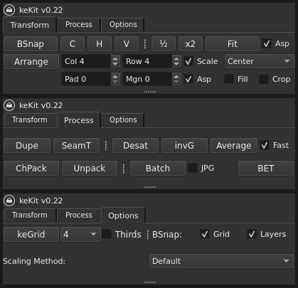
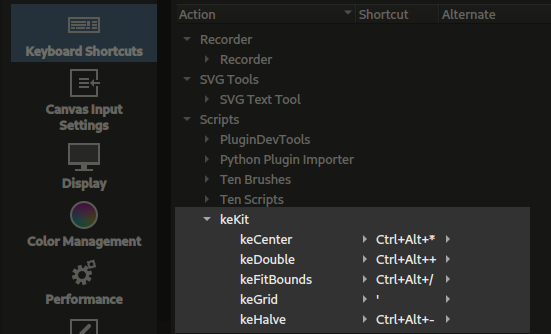
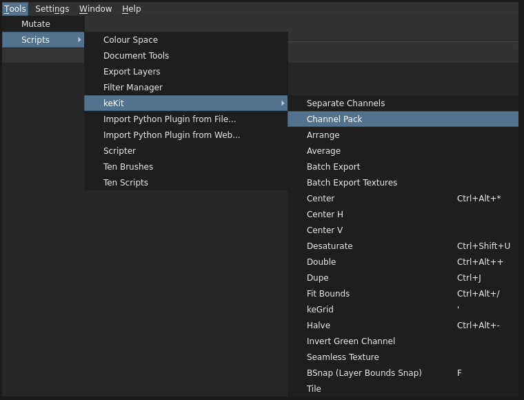
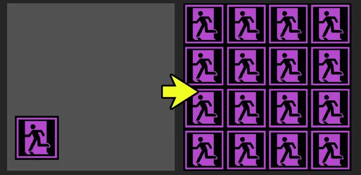
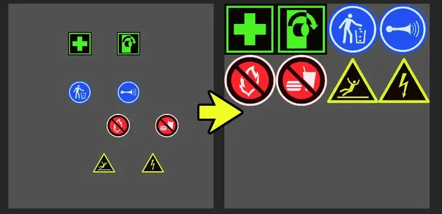
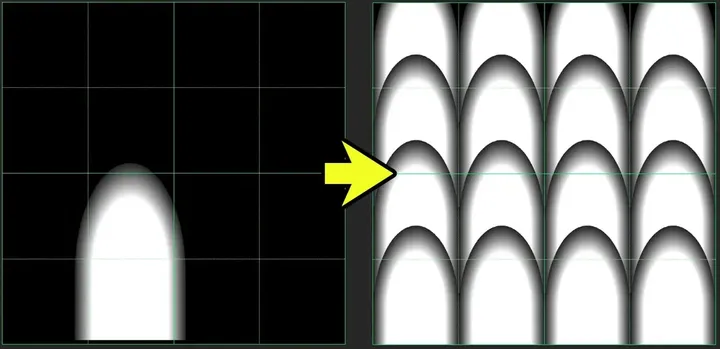
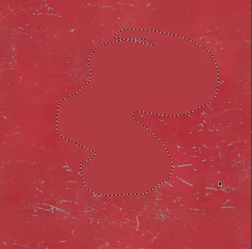
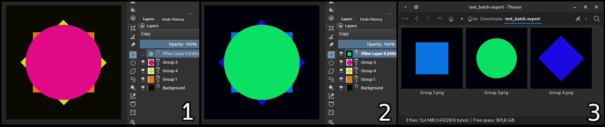
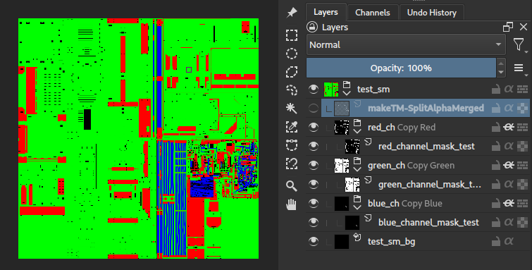
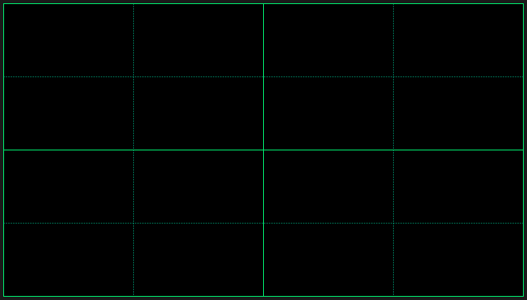

# keKit   

A general purpose (script collection) plug-in.  
The keKit Docker is designed to be as compact as possible. (Optionally using tabs):

  
_To use the alternative tabs-docker, switch the names for "kekit_docker.pybkp" & "kekit_docker.py"_
&nbsp;

### Installation/Updating   
1. Download zip file, from 'Releases' section -->
2. [Manual installation/upgrade method recommended](https://docs.krita.org/en/user_manual/python_scripting/install_custom_python_plugin.html#how-to-install-a-python-plugin):
   - Open downloaded zip file
   - In Krita, go to Settings ‣ Manage Resources ‣ Open Resource Folder. 
   - Put _kekit.desktop_ and _kekit_ folder inside the _pykrita_ folder. 
   - Put _kekit.action_ into the _actions_ folder. 
   - Restart Krita.

&nbsp;
### Shortcuts   
Some scripts can be assigned to shortcuts (and some are intended to be!)  
in _Settings/Configure Krita/Keyboard Shortcuts/Scripts/keKit_:

  
  
The scripts are also listed in _Tools/Scripts_ in a _keKit sub-menu_,  
as an alternative to the docker (for some scripts), or just a quick shortcut overview:

  

&nbsp;
## keKit Scripts:   

### 🔧 Layer Bounds Snap (BSnap)
Snap/Move selected paint/vector/group layer by **Layer's nearest bounds** anchor point to the **Document's nearest bounds** anchor point  
_Tip: Assign to shortcut_  

Short YouTube Video demo:  

- These are the 9 (virtual) Bounds Anchor/Snapping Points (_for both layer(s) & document_):  

| | | |
|:---|:---|---:|
| ● Top Left        | ● Top         | Top Right         ● |
| ● Left            | ● Center      | Right             ● |
| ● Bottom Left     | ● Bottom      | Bottom Right      ● |

#### ⚙️ BSnap Options
In the options tab.
- Grid Snapping (Intersections of grid lines make snapping points)  
- Layer Snapping (other layers bounds' snapping points)  

&nbsp;
### 🔧 Center
Centers the selected/active paint layer  
_Note: These can **mostly** be replaced with BSnap. But not **exactly**, so they're still available as options, should you prefer._  

Variants:
- H : Centers paint layer to Horizontal center (only)
- V : Centers paint layer to Vertical center (only)

&nbsp;
### 🔧 Half & Double
Scale selected paint/vector layer (or group) 50% or 200%

&nbsp;
### 🔧 Fit Bounds
Stretches selected paint/vector layer (or group) to fit the document bounds  
Option:
- **Aspect**: Fit Bounds maintains aspect ratio of the layer

&nbsp;
### 🔧 Arrange
Arrange layer(s) (paint, vector etc.) in a grid layout defined by columns & rows dividing the document's size  
- If ONE layer is selected, the cells will be filled up with automatically duplicated layers  
  
- If MORE than one layer is selected, they will fill up as many cells as are selected (row by row, in selection order)  
  

#### Arrange Options
- _Columns & Rows_ (divide the document in grid cells, i.e: "4x4" etc.)
- _Scale_ will resize the layer to fit the cell
- _Aspect_ maintains layers aspect ration when _Scale_ is used. Or not.
- _Cell Alignment_ sets the "anchor" point _inside the cell_, in a pull-down menu (same 9 placement options as BSnap table above)
- _Padding & Margin_ - Padding adds pixels _inside_ the cells, and margin _outside_ the cells (border). Separated for flexibility.
- _Crop_ If you know how much of the (paint only) layer goes outside the cell, use for auto-cropping. (_Scale_ off)
- _Fill_ use with Scale to fit by the shortest axis, allowing for overlap in the other - for overlapping patterns (scales and such).
  
&nbsp;  
Example Fill Pattern:  
  

Workflow Suggestions:  
- Use the Grid (keGrid) for cell size "preview" (as pictured above) (Note: Arrange itself does _not_ use the grid)  
- When making/designing repeating patterns: 
  - Make a [clone layer](https://docs.krita.org/en/reference_manual/layers_and_masks/clone_layers.html) of the source layer,
  - 'Arrange' the _clone_ into an array of clones. Non-destructive and flexible.
  - _Tip: The clone source layer can be a group!_
  - _Tip: To move the source layer afterwards:   
          Use the "Move layer with content" Move Tool option - unless you also want to move all the clones_

          
&nbsp;
### 🔧 Dupe
Duplicates selection, or the entire layer if there's no selection, directly into a new layer  
Also creates a flattened group copy when used on group(s)  

&nbsp;
### 🔧 Desaturate
1-click Desaturate. 
Also, **undo** to reveal the temporary desaturated duplicate (that's merged down),  
resulting in a desaturated _duplicate_ layer.

&nbsp;
### 🔧 Invert Green Channel
Inverts the green color channel. Common texturing operation.

&nbsp;
### 🔧 Average Color

Set selection. Also; No Selection == Full selection (MODO style convienience!)  
Applies the average color of the pixels to the selection.  
Ignores color from transparent pixels - for a better/expected average
- (F) Option:
  - FAST: (On) Limited pixel sample size for substantial speed increase (any image size) but with less color accuracy.
  - ACCURATE: (Off) Process every single pixel for more accurate result (*Very* slow on large selections/images)  

  
&nbsp; 
### 🔧 Batch

- Batch-exports **visible** root paint, clone & vector **layers & groups** from the current active document.
- Automatically creates a sub directory for the exports based on the document name & location
    - The document needs to be **saved** before the batch operation
- **Excluded** (visible, root) Layers/Groups: 'Fx', 'Foreground', 'Background', "fg" or "bg"**.  
    These will not be exported - but kept visible _during_ export to **still affect output**:  
    - Useful for processing different groups with the *same filters/fx* and/or *backdrop*  
    Image example: Three layers with transparency (1) all use the same background (solid black)  
    and a "fx" hue filter (2) affects all the layers then batch-exported (3)  
    - Excluded nodes are capitalization indifferent - any style will work: fx, FX, Fx etc.

Options:
- **JPG**: Export in JPG format instead of PNG.
- Format Defaults: (override in ke_batch.py if needed)
  - PNG: Alpha, Level 0/Uncompressed. *For maximum speed now - [oxipng](https://github.com/oxipng/oxipng) (or [pngcrush](https://en.wikipedia.org/wiki/Pngcrush)) later.  
  (For maximum non-destructive size optimization - including removing an unnecessary alpha channel)*
  - JPG: 85%. *For less quality-sensitive use-cases*  
  
&nbsp; 
### 🔧 Batch Export Textures (BET)
Batch-variant for a PBR game/vfx-ish texture export workflow, exporting **visible** layers and groups.  
Works by strict naming convention:

- **Auto-naming**: The layers/groups will use the **document name as the basename** and add the the the layer/group names as **suffixes**.  
  E.g: "concrete01.kra" exports become "concrete01_c", "concrete01_r" etc.  
  _(if the layers/groups are named "c" and "r" - don't add any underscores manually!)_  
- **Grayscale Layers/Groups**:
    - Named "b","d","r","m","ao","e","bump", "disp", "displacement", "roughness", "rough", "metal", "metallic", "emissive", or "mask",  
      will be exported as **8-bit grayscale**
- **Color Layers/Groups**:  
  - All other names, such as "diffuse", "c" or "n" or whatever that's **not** in the grayscale list,  
    will be exported as **8-bit RGB**.

- Note:
  - Exports will be placed in the same dir as the doc (**not** in a generated sub-dir as Batch).
  - BET follows the same exclusion rules for **fx, fg & bg** layers/groups as standard Batch.
  - The export will **autosave** (saved doc **must** be latest + far less annoying than to forget...).
  - PNG-only. Level 0/Uncompressed. *For maximum speed now - [oxipng](https://github.com/oxipng/oxipng) (or [pngcrush](https://en.wikipedia.org/wiki/Pngcrush)) later.*
  - _Slow - it can take some time in big documents with a lot groups_

  
&nbsp;
### 🔧 Channel Pack (RGBA Channel Packing)

Automates Channel-packing 3-4 layers into a single image using the RGBA channels.  
Often used in real-time 3D. ['Splat-maps'](https://en.wikipedia.org/wiki/Texture_splatting) or ['ORM Textures'](https://docs.godotengine.org/en/stable/tutorials/3d/standard_material_3d.html) for example. 

- The "New" option toggled will create a new document for the setup
- Auto-merges groups when making a new doc, for convenience
- Uses [clone layers](https://docs.krita.org/en/reference_manual/layers_and_masks/clone_layers.html) (when not making new doc) to enable (non-destructive) “orm” export (for BET)  

&nbsp;  
**To Export RGB (No Alpha Channel)**:  
Select 3 layers   
- **Select one by one in intended RGB order**
- Run **chPack** & the selected layers will be arranged in a group, prepared for export
- Export/save as usual  
- chPack detects “ao”/“o”,“r” & “m” naming in selected nodes and names chPack group “orm”
- Re-running chPack will replace an already existing “orm” group if found (iterative non-destructive workflow)  

&nbsp;  
**To Export RGBA**:  
The standard Krita PNG Export will erase data in the RGB channels when using Alpha.  
Instead, Kritas ["Split-Alpha"](https://docs.krita.org/en/reference_manual/layers_and_masks/split_alpha.html) feature is used for full RGBA channel export:  

- Select 4 Layers - in RGBA selection order
- Note that the Alpha layer cannot be a clone: Manually update Alpha.
- Run **chPack** & the selected layers will be arranged in a group, prepared for export
- Use RMB on the created Group Transparency Mask (as the "Alpha Channel") and use *Split-Alpha / Save as Merged* to export.

&nbsp;
### 🔧 Channel Unpack (RGB Channel Un-Packing)
Creates separated Red, Green and Blue color channel [clone layers](https://docs.krita.org/en/reference_manual/layers_and_masks/clone_layers.html), in groups, of the selected paint layer.   
Note that alpha is not "unpacked" and will need to be handled separately.  
Made for ['ORM Texture'](https://docs.godotengine.org/en/stable/tutorials/3d/standard_material_3d.html) unpacking. Non-destructive.  

&nbsp;
### 🔧 Tile
Scales, duplicates and places 4 tiles (copies) of the selected paint layer to fit the image bounds.  
Note: Not listed in the keKit docker, as it is mostly replaced by _Arrange_. Still available for legacy support.
- Make sure the layer is trimmed to image size!

&nbsp;
### 🔧 Seamless Tiling
Simple 'cross-offset' seamless tiling - creates a group of masked layers.  

Short YouTube Video demo:  

- This is a very simple method, do not expect every case to work well 
- The mask is a regular PNG included in keKit, adjust to your liking if needed
- Tip: Tweak with Kritas Wrap-around mode.

&nbsp;
### ⚙️ keGrid
Calculates a relative rectangular grid (with user-defined divisions) based on the document size.  

- Will automatically clear "grid offset" values.
- Not "dynamic": Requires updating (toggle on/off) if your document size changes.  
- _Some line-offset glitches may occur, especially when using thirds/uneven pixel sizes  
  (it is just auto-calculating the Krita's fixed grid, thus the same limitations)_

Options:
- **Divisions**: Set the grid division (with automatic subdivisions). "4" = 4x4 (16 cell) grid, etc. (as image above)  
  _Note: I'm using the subdivisions for esthetic reasons, and usability (keeping center lines distinct)._
- **Thirds**: Uses Rule of Thirds instead of quad grid layout.  
  Note: Thirds divs are pow3, i'm just re-using the pow2 list, so then 2=3, 4=9 and so on.  
        Also, to re-iterate, line-glitches are bound (sic) to happen (see above)
  
Note:
  - Intended for shortcut use (E.g: replacing "Show Grid" toggle-shortcut)  
  - To snap the layer (bounds) to the grid (intersections) you can use **BSnap** (see above)  

&nbsp;
### ⚙️ Scaling Method
Choose preferred pixel transform processing method for Half, Double & Fit Bounds etc.
- _Mitchell, Lanczos3 etc._
- _Default_ is a keKit scripts special: Uses **Lanczos3** scaling down & **Mitchell** scaling up. 

&nbsp;
### Feedback 
Right here. Leave messages (with appropriate tags & description) in Issues tab at the top!

Alternatively, check the [keKit thread](https://krita-artists.org/t/kekit-for-krita/74504) on the krita-artists.org forum.

